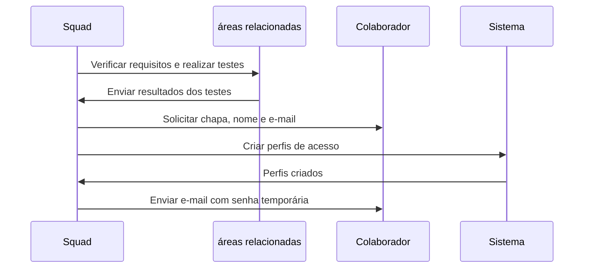
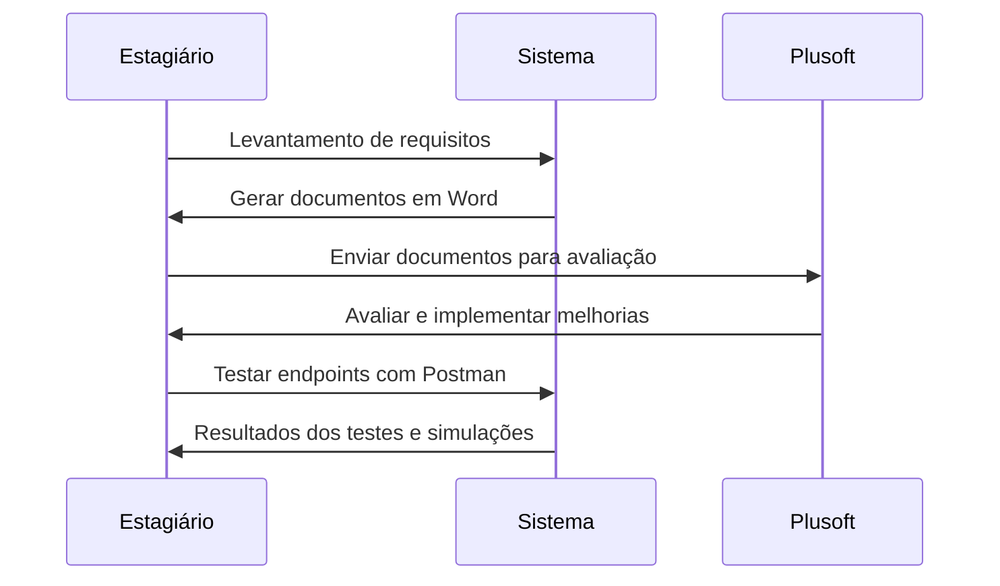

# Squad Ágil Atendimento

A squad Ágil Atendimento trabalha com o backoffice, com o pós-atendimento. O foco da squad é ver a viabilidade de melhorias e trazer novos requisitos de sistemas para agregar valor nas plataformas como o projeto Florida e Omni, o atual CRM da Plusoft. Entramos em reuniões para alinhamentos de esteira de produção e testes com as empresas que atuam no desenvolvimento dos respectivos projetos.

As demandas são passadas via WhatsApp com um grupo de comunicação da própria squad, e Teams, onde possuímos calendário das reuniões e de demandas mais específicas.

## Principais Demandas do Estagiário

### StudioCard

StudioCard é a nova plataforma de cartões da Pefisa, onde será possível realizar a maioria das operações necessárias neste ambiente, como por exemplo:

- Faturas
- Status do cliente
- Limites do cartão
- Mapeamento dos processos
- Conciliação

Nosso principal plano de ação é verificar com os departamentos respectivos, como o de contabilidade, para realizar testes a fim de encontrar bugs ou garantir que está conforme os requisitos previstos, além de testes de UI e UX. 

Para conceder acesso a funcionários para testarem, fazemos a criação de perfil de acesso, onde é necessário a chapa, nome e e-mail do colaborador. Em seguida, é enviado um e-mail com uma senha temporária.

## Fluxo

### Omni e Chatbots

Outra atividade importante é o levantamento de requisitos, que são gerados em documentos Word para entregar à Plusoft, que avaliará e implementará as melhorias. Já trabalhamos em duas documentações onde pretendemos implementar:

- Bloqueio de cartão roubado com o chatbot do WhatsApp
- Antecipação de parcelas via chatbot

Os documentos demonstram o foco da nova feature, objetivo, ferramentas necessárias, como endpoints específicos da API, autenticação e criação do fluxograma passo a passo. Através do Postman, testamos os endpoints e realizamos simulações para facilitar a disponibilização do arquivo para produção.

## Fluxo

### Refatoração de Fluxogramas e Estudo da Plataforma Omni

Uma recente migração de sistemas exigiu a refatoração do fluxograma existente do AGV, que antes era no Miro e passou a ser no Draw.io. Realizamos uma força-tarefa para entregar essa demanda.

Foi liberado o acesso à plataforma Omni, que contém a ferramenta Academy, que ensina passo a passo o CRM utilizado, permitindo descobrir as limitações atuais.